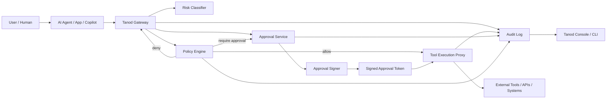

# Tanod

**Open-source signed execution control for AI agents.**

Tanod is a security control plane that sits between AI agents and the tools they use. It intercepts tool calls before execution, evaluates them against deterministic policy, requires human approval for high-risk actions, cryptographically binds approvals to the exact requested action, and records decisions in an auditable trail.

AI agents should not be able to grant admin access, delete data, deploy to production, send sensitive information, or run destructive commands just because a model decided to call a tool.

Tanod separates **reasoning** from **execution**.

```text
AI Agent → Tanod Gateway → Policy → Approval → Signed Execution → Audit → Tool
```

## Project status

Tanod is in early v0.1 development. The current repository contains the first executable gateway skeleton:

- HTTP API for evaluating agent tool-call requests
- Deterministic policy engine with allow / deny / require-approval decisions
- Risk levels from L0 to L4
- Canonical argument hashing
- Ed25519 signed approval tokens bound to exact tool-call arguments
- Tamper-evident append-only audit log primitive
- Example policies and tool-call requests
- Node test suite for policy, signing, and audit behavior

The implementation is currently TypeScript/Node.js because this build environment has Node available but not Go. The architecture is intentionally modular so core services can later be split, rewritten, or complemented by Go/Rust components where appropriate.

## Why Tanod exists

Traditional automation mostly failed by following the wrong process or receiving bad inputs. AI agents introduce a different risk: they can confidently misunderstand intent and then take real action.

Prompt guardrails are not enough. The dangerous boundary is not just what the model says; it is what the agent tries to **do**.

Tanod focuses on the execution boundary:

- Which agent is acting?
- Which human or system is accountable?
- Which tool is being called?
- What exact arguments are being passed?
- Is the target production, customer-impacting, sensitive, or irreversible?
- Does policy allow, deny, or require human approval?
- If approved, is the approval bound to the exact action?
- Can the action be audited later?

## Core principles

1. **Agents are not trusted by default**  
   Agents can propose actions; Tanod decides whether those actions can execute.

2. **Tool calls are security events**  
   Every meaningful tool call should be inspectable, governable, and auditable.

3. **Policy lives outside the model**  
   Security decisions should not depend on prompt wording, model behavior, or context-window integrity.

4. **Approval binds to the exact action**  
   A human approval must not be reusable for different arguments, users, tools, systems, or environments.

5. **Audit must be trustworthy**  
   Tanod records a hash-chained event stream so later tampering is detectable.

## High-level architecture



## Runtime flow

### Low-risk action

```text
1. Agent requests a read-only diagnostic tool call.
2. Tanod canonicalizes and hashes the arguments.
3. Policy engine returns allow.
4. Tanod records the decision in the audit log.
5. The tool proxy may execute the request.
```

### High-risk action

```text
1. Agent requests a production write action.
2. Tanod classifies the action as high/critical risk.
3. Policy returns require_approval.
4. Human approver reviews the exact action.
5. Tanod signs an approval token containing the tool argument hash.
6. Tool proxy verifies the token and argument hash before execution.
7. Tanod records request, approval, execution, and result events.
```

### Tampering attempt

```text
1. Human approves: grant admin to john@example.com.
2. Agent changes arguments to jane@example.com.
3. Tool proxy recomputes the argument hash.
4. Hash does not match the signed approval token.
5. Tanod blocks execution and records a critical audit event.
```

## Current API

### `GET /healthz`

Returns process status.

### `POST /v1/decisions`

Evaluates a proposed tool call.

Request:

```json
{
  "version": "v1",
  "request_id": "req_demo_001",
  "timestamp": "2026-05-13T13:30:00Z",
  "actor": {
    "user_id": "ross@example.com",
    "roles": ["platform_admin"]
  },
  "agent": {
    "agent_id": "openclaw-main",
    "agent_type": "it-ops-agent",
    "environment": "prod"
  },
  "tool": {
    "name": "shell.exec",
    "category": "infrastructure",
    "operation": "write"
  },
  "target": {
    "system": "homelab-fedora",
    "environment": "prod"
  },
  "arguments": {
    "command": "sudo systemctl restart openclaw-gateway"
  },
  "context": {
    "reason": "Gateway appears unhealthy"
  }
}
```

Response:

```json
{
  "request_id": "req_demo_001",
  "decision": "require_approval",
  "risk_level": "L3",
  "policy_ids": ["approve-prod-shell-write"],
  "argument_hash": "sha256:...",
  "message": "Human approval required before executing shell command on production target."
}
```

### `POST /v1/approvals`

Signs an approval token for an exact tool-call request.

Request:

```json
{
  "request": { "...": "tool call request from /v1/decisions" },
  "approved_by": "ross@example.com",
  "approved_role": "platform_owner",
  "policy_id": "approve-prod-shell-write",
  "ttl_seconds": 900
}
```

Response:

```json
{
  "approval_token": "<compact signed token>",
  "argument_hash": "sha256:...",
  "expires_at": "2026-05-13T13:45:00.000Z"
}
```

## Policy model

Policies currently use JSON files and a small deterministic matcher. YAML support and pluggable OPA/Cedar evaluation are planned.

Example policy:

```json
{
  "id": "approve-prod-shell-write",
  "description": "Require approval for shell write commands on production systems",
  "when": {
    "tool.name": { "equals": "shell.exec" },
    "tool.operation": { "equals": "write" },
    "target.environment": { "equals": "prod" }
  },
  "then": {
    "decision": "require_approval",
    "risk_level": "L3",
    "message": "Human approval required before executing shell command on production target."
  }
}
```

Supported match operators:

- `equals`
- `contains`
- `contains_any`
- `matches`
- `in`

Policy evaluation is first-match by explicit priority, then file order. If no policy matches, Tanod defaults to `deny`.

## Repository layout

```text
.
├── src/
│   ├── audit.ts          # hash-chained append-only audit events
│   ├── canonical.ts      # stable JSON canonicalization and SHA-256 hashing
│   ├── domain.ts         # core request/decision/token types
│   ├── index.ts          # process entrypoint
│   ├── policy.ts         # deterministic policy matcher/evaluator
│   ├── server.ts         # HTTP API
│   └── signing.ts        # Ed25519 approval token signing/verification
├── tests/                # node:test coverage
├── examples/
│   ├── policies/         # starter policies
│   └── requests/         # sample agent tool calls
├── package.json
├── tsconfig.json
└── README.md
```

## Local development

Install dependencies:

```bash
npm install
```

Build and test:

```bash
npm test
```

Run the gateway:

```bash
TANOD_POLICY_FILE=examples/policies/default.json \
TANOD_AUDIT_FILE=.tanod/audit.jsonl \
npm start
```

Defaults:

- Host: `127.0.0.1`
- Port: `8787`
- Policy file: `examples/policies/default.json`
- Audit file: `.tanod/audit.jsonl`

Example decision request:

```bash
curl -sS http://127.0.0.1:8787/v1/decisions \
  -H 'content-type: application/json' \
  --data @examples/requests/shell-write-prod.json | jq
```

## v0.1 roadmap

The first release should prove the core idea end-to-end:

- [x] Define tool-call request schema
- [x] Build deterministic policy evaluator
- [x] Implement allow / deny / require-approval decisions
- [x] Compute canonical argument hashes
- [x] Sign approval tokens with Ed25519
- [x] Verify approval tokens against exact arguments
- [x] Write hash-chained audit events
- [ ] Add persistent approval queue
- [ ] Add execution proxy abstraction
- [ ] Add shell adapter
- [ ] Add HTTP adapter
- [ ] Add `tanodctl` CLI
- [ ] Add Docker Compose deployment
- [ ] Add basic web approval console
- [ ] Add GitHub Actions CI

## Positioning

Avoid thinking of Tanod as just another LLM firewall. Tanod is narrower and sharper:

> **No high-risk tool call executes unless policy allows it or a human signs the exact action.**

That signed execution boundary is the product.
